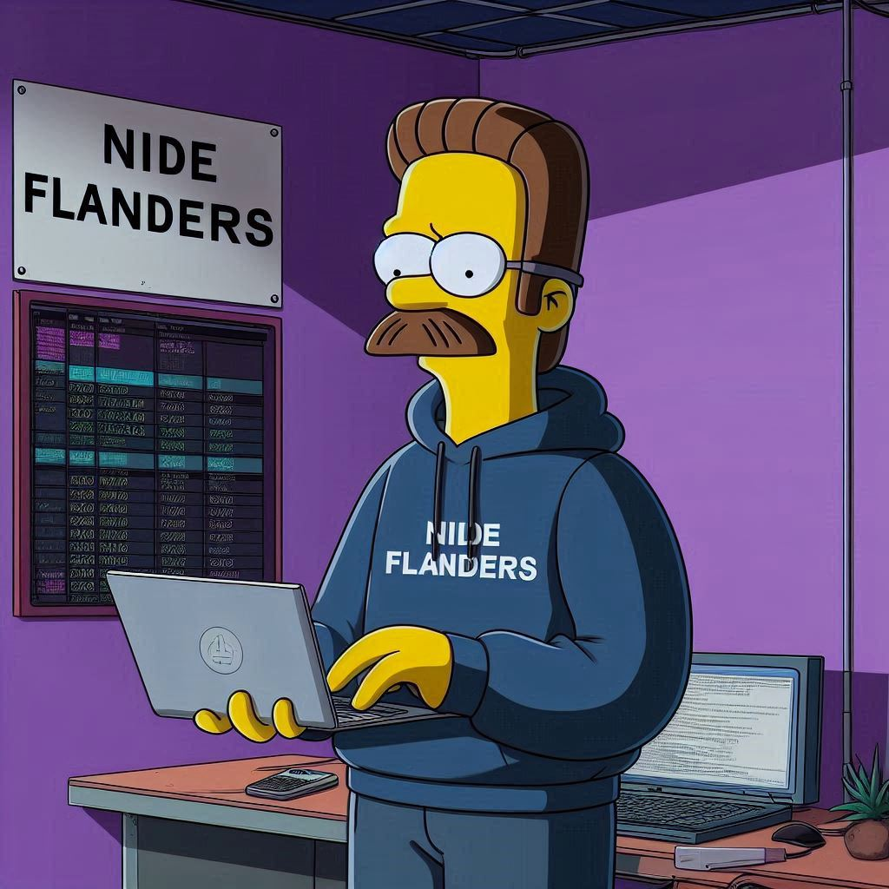

# NiDeFlanders

Proyecto universitario para la privacidad y anonimato en Kali Linux.

<div align="center">
	
</div>


# NiDeFlanders

VPN para Kali Linux orientada a máxima privacidad y anonimato. Arquitectura hexagonal, principios SOLID, DRY, KISS y Clean Code.


## Instalación y ejecución correcta
1. Descarga el repositorio desde GitHub.
2. Crea y activa un entorno virtual (recomendado):
	```bash
	python3 -m venv .venv
	source .venv/bin/activate
	```
3. Instala las dependencias de Python:
	```bash
	pip install -r requirements.txt
	```
4. Instala dependencias del sistema (Kali Linux):
	```bash
	sudo apt update
	sudo apt install tor privoxy python3-gi gir1.2-gtk-3.0
	```
5. Da permisos de ejecución al script:
	```bash
	chmod +x run_nideflanders.sh
	```
6. Ejecuta el script para iniciar la app:
	```bash
	./run_nideflanders.sh
	```
	O ejecuta manualmente la interfaz:
	```bash
	python3 -m interface.main_window
	```
	Esto instalará dependencias y abrirá la interfaz gráfica automáticamente.

## Características principales
- Solo para Kali Linux (no Windows)
- Interfaz gráfica sencilla (PyGObject/GTK)
- Cambia país/IP, activa/desactiva VPN
- Todo el tráfico pasa por TOR y Privoxy
- Sin logs, cookies ni rastros
- Protección extra: anti-leaks DNS/WebRTC, limpieza de logs
- Código seguro y verificado (2025)

## Estructura del proyecto
- `application/`: Casos de uso y servicios
- `infrastructure/`: Integraciones externas (TOR, Privoxy, VPN, bridges)
- `interface/`: Interfaz gráfica y CLI
- `tests/`: Pruebas unitarias

## Dependencias
- Python 3.12+
- stem (control de TOR)
- requests (HTTP anónimo)
- toripchanger (cambio de IP)
- privoxy (proxy filtrado, instalar por sistema)
- PyGObject/GTK (instalar por sistema)

## Seguridad
Todas las dependencias se verifican para evitar vulnerabilidades conocidas. El programa no guarda logs ni rastros.

## Licencia
GNU GPL v3

---

## Documentación adicional

- [Guía de uso](NiDeFlanders/USO.md)
- [Arquitectura del proyecto](NiDeFlanders/ARQUITECTURA.md)


---
Web del autor: [https://dogsouldev.github.io/Web/](https://dogsouldev.github.io/Web/)
- interface/: Interfaz gráfica y CLI
